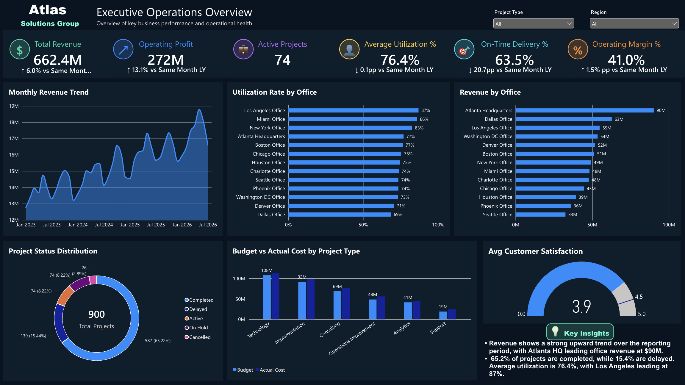
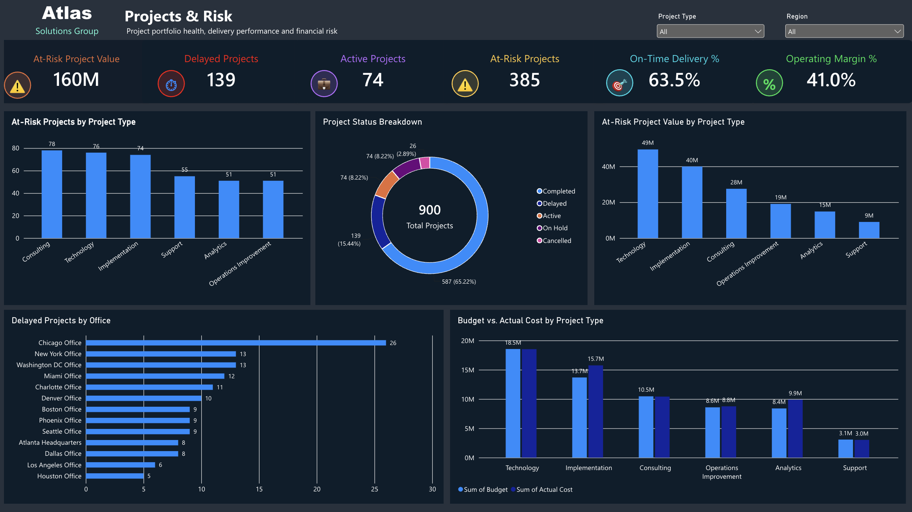
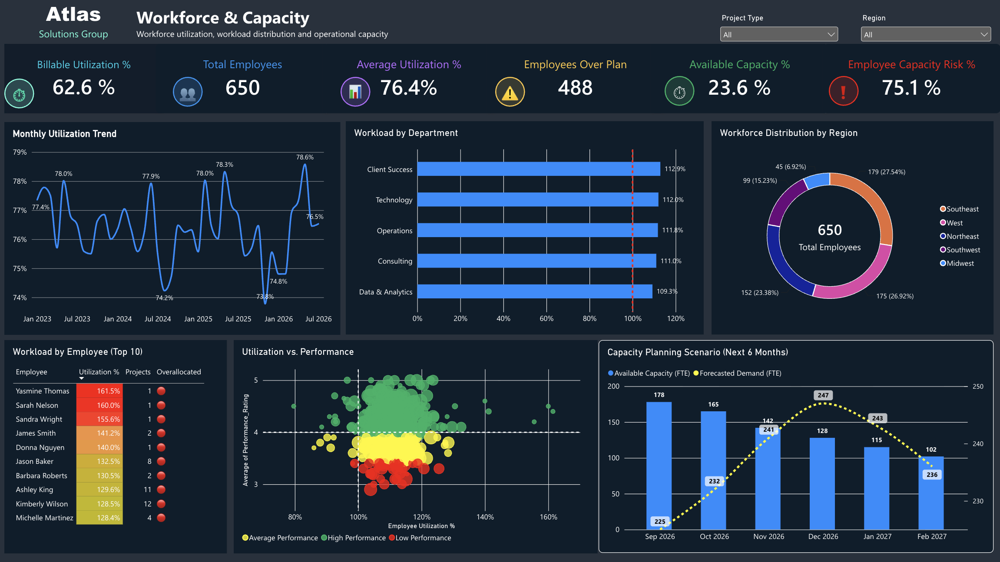

# Atlas Solutions Group — Enterprise Operations Intelligence Dashboard

## Project Overview

Atlas Solutions Group is a fictional multi-office professional services organization created for this business operations analytics portfolio project.

The objective of the project was to build an end-to-end business intelligence solution that gives management a centralized view of financial performance, project delivery, operational risk, workforce utilization, and capacity.

Operational data was transformed, modeled, analyzed, and presented through a three-page Power BI dashboard designed to support executive and operational decision-making.

## Dashboard Preview

### Executive Operations Overview

### Projects & Risk

### Workforce & Capacity

## Project Files

- `Atlas_Solutions_Group_project.xlsx` — source operational dataset used for data preparation, modeling, and analysis
- `executive-overview.png` — Executive Operations Overview dashboard
- `projects-risk.png` — Projects & Risk dashboard
- `Workforce-Capacity.png` — Workforce & Capacity dashboard
  
## Business Objectives

The analysis was designed to answer key operational questions:

- How is the organization performing financially?
- Which offices contribute the most revenue?
- How effectively are projects being delivered?
- Which project types carry the greatest operational and financial risk?
- Where are project delays and budget overruns concentrated?
- How effectively is workforce capacity being utilized?
- Which departments and employees are experiencing workload pressure?
- How does planned future demand compare with available workforce capacity?

## Dashboard Structure

The Power BI report contains three analytical pages.

### 1. Executive Operations Overview

Provides leadership with a high-level view of organizational performance and operational health.

Key metrics and analysis include:

- Total Revenue
- Operating Profit
- Active Projects
- Average Utilization
- On-Time Delivery
- Operating Margin
- Monthly Revenue Trend
- Utilization Rate by Office
- Revenue by Office
- Project Status Distribution
- Budget vs. Actual Cost by Project Type
- Average Customer Satisfaction

### 2. Projects & Risk

Provides a focused view of project portfolio health, delivery performance, and financial risk.

Key metrics and analysis include:

- At-Risk Client Value
- Delayed Projects
- Active Projects
- At-Risk Projects
- On-Time Delivery
- Operating Margin
- At-Risk Projects by Project Type
- Project Status Breakdown
- At-Risk Client Value by Project Type
- Delayed Projects by Office
- Budget vs. Actual Cost by Project Type

A project is classified as **at risk** when it is delayed or when actual cost exceeds 105% of its budget.

At-Risk Client Value represents the annual contract value associated with clients that have at least one project meeting the defined at-risk criteria.

### 3. Workforce & Capacity

Evaluates workforce utilization, workload distribution, employee performance, and operational capacity.

Key metrics and analysis include:

- Billable Utilization
- Total Employees
- Average Utilization
- Overallocated Employees
- Available Capacity
- Employee Capacity Risk
- Monthly Utilization Trend
- Workload by Department
- Workforce Distribution by Region
- Workload by Employee
- Utilization vs. Performance
- Six-Month Capacity Planning Scenario

The capacity planning scenario compares available workforce capacity with forecasted demand to highlight potential future resource constraints.

## Tools & Technologies

- **Power BI** — dashboard development and interactive reporting
- **DAX** — KPI calculations, business logic, and analytical measures
- **Power Query** — data cleaning and transformation
- **Excel** — source data preparation and validation
- **Data Modeling** — relationships across operational business tables

## Key Business Logic

Custom measures were developed to convert operational data into decision-support KPIs.

Examples include:

- **Operating Profit** = Revenue − Operating Cost
- **Operating Margin** = Operating Profit / Revenue
- **At-Risk Project** = Delayed OR Actual Cost > 105% of Budget
- **On-Time Delivery** = Completed projects delivered on or before their planned end date / completed projects with an actual end date
- **Employee Overallocation** = Employees whose Actual Hours exceed Assigned Hours
- **Revenue Growth** = Latest month revenue compared with the same month in the prior year
- **Operating Profit Growth** = Latest month operating profit compared with the same month in the prior year

## Key Insights

The analysis identified several operational findings:

- Total revenue reached approximately **$662.4M**, with an overall upward trend across the reporting period.
- Operating profit reached approximately **$272M**, representing an operating margin of approximately **41.0%**.
- Atlanta Headquarters generated the highest office revenue at approximately **$90M**.
- Average workforce utilization is approximately **76.4%**, while billable utilization is approximately **62.6%**.
- Los Angeles Office recorded the highest office utilization rate at approximately **87%**.
- Approximately **65.2% of projects are completed**, while **139 projects are delayed**.
- The project risk analysis identifies **385 at-risk projects** based on delay and cost-overrun criteria.
- Approximately **$160M in annual contract value** is associated with clients that have at least one at-risk project.
- Employee-level workload analysis identifies cases where actual hours exceed assigned hours, highlighting potential capacity pressure.
- The six-month capacity planning scenario compares available workforce capacity with forecasted demand to support forward-looking resource planning.

## Skills Demonstrated

This project demonstrates practical experience in:

**Business Operations Analytics • Business Intelligence • Data Analysis • KPI Development • Power BI • DAX • Power Query • Data Modeling • Dashboard Development • Financial Analysis • Project Risk Analysis • Workforce Analytics • Capacity Planning • Data Visualization**

## Project Purpose

This portfolio project demonstrates the development of a business intelligence solution from operational data through data preparation, modeling, KPI development, analysis, and dashboard design.

The final solution enables management to monitor organizational performance, identify operational and financial risk, evaluate workforce capacity, and support data-driven business decisions.
